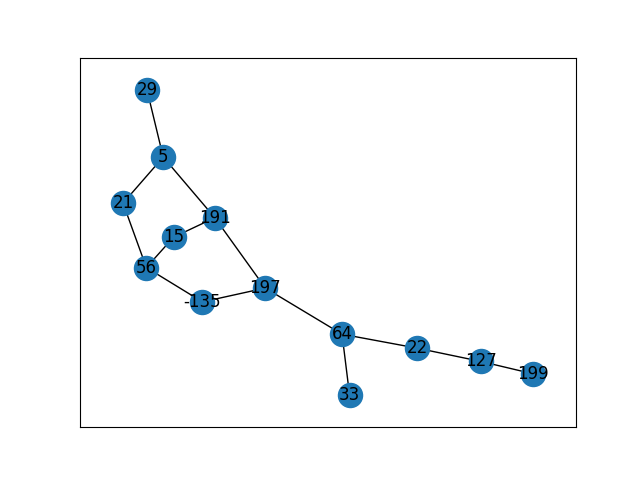

# NodeGame
Node Game

# Game Idea
I wanted to create a game that would be similar to
how the Prime Radiant is used in foundation and the treasure planet map.
I wanted to have a puzzle that you could turn and twist that would add values
together to reach certain sum.

# How to play
You will have a starting point ( a number -------> 87
from there you will have to move from point to point to add up to a 
certain amount to solve the problem. (That amount is 100)
Still working on the mechanics of the game
As long as your numbers add up to 100 from the list, You will be ok

# Commands and running the game
terminal command : python3 nodeGame.py 
this is used to play one game
terminal command : python3 nodeGame.py 5
the argument 5 means that i will play the game 5 times
Enter null if there is no solution
Enter exit to end program
Enter answer in this format : 100,220,-90,110 

# Updates Coming
1. Better algorithms 
2. Score Board
3. Tracking of time to solve problem
